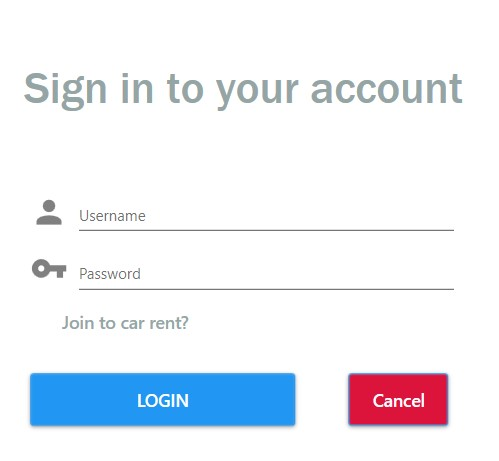
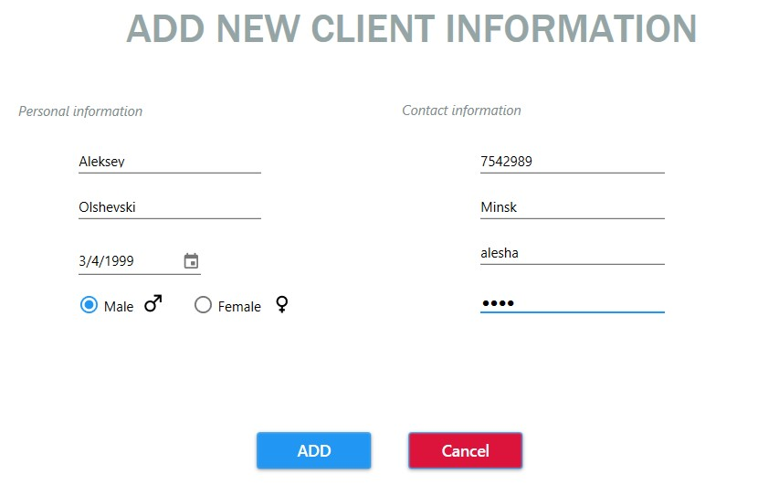
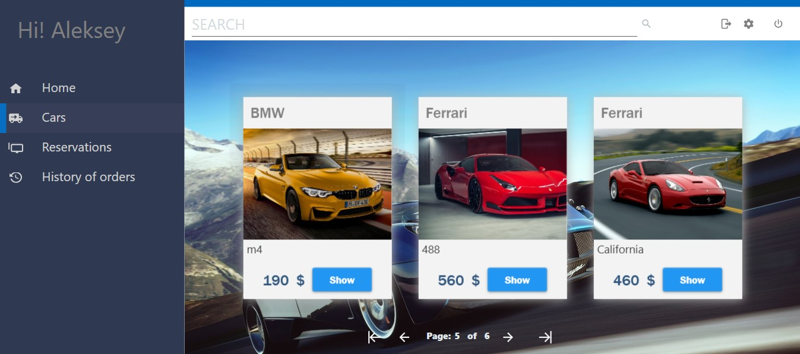
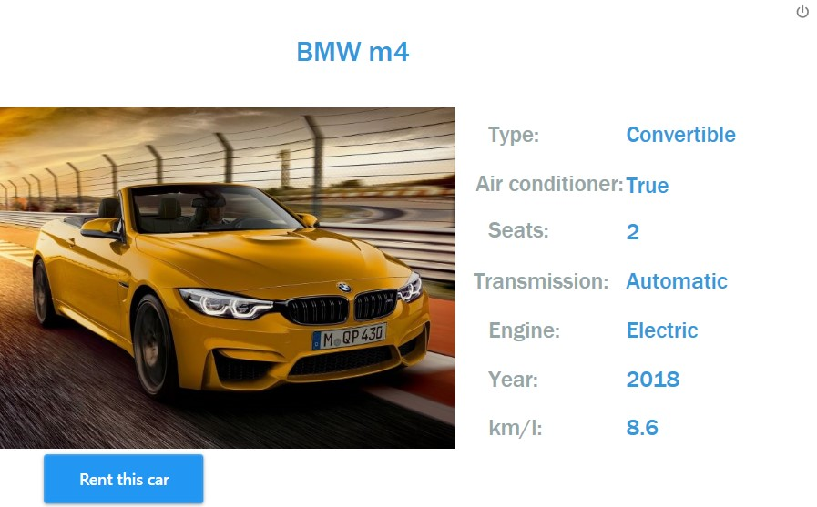
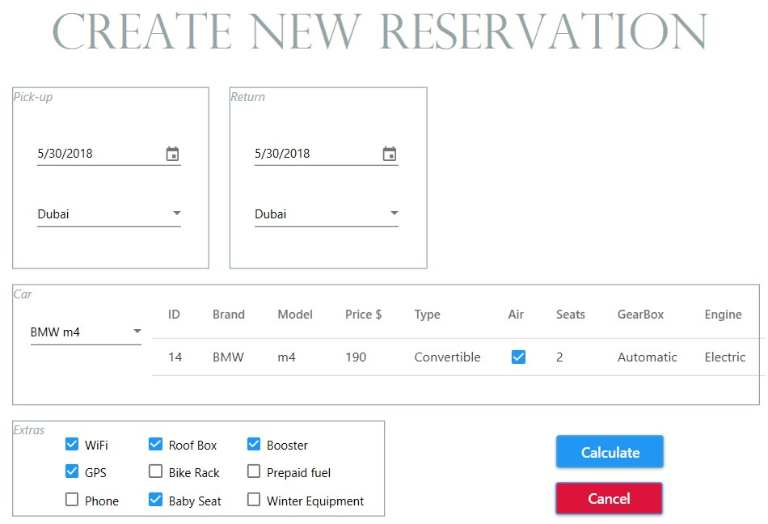
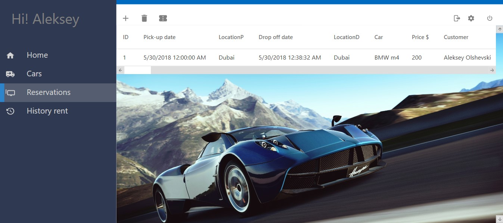
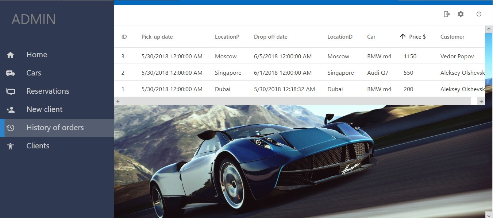

# Rent auto
### Desktop application for renting an auto

#

##  Software Requirements
•	  Database based on file system in .json format (The ability to serialize and deserialize objects).

•	**For user:**
  1.	Просмотр информации о доступном ему парке машин (просмотр их характеристик).
  2.  Просмотр своей истории заказов, потраченных средств,
  3.  Просмотр текущего заказа для подтверждения или отклонения бронирования.
  
•	**For admin:**
  1.	Manage all car rental entities
  2.	Add, delete cars, as well as make changes to the current catalog of cars.
  3.	Add, delete, confirm the order for the rental car. 
  4.	Add a new client. 
  5.	View the order history of each user.
  6.   View information about each user.
  7.   View statistics.
  
  #
  
  ## Sign up
  
  
  #
  
  ## Registration new user
  
  
  #
  
  ## User main window
  
  
  #
  
  ## Auto information
  
  
  #
  
  
  
  
  
  ## Admin history of orders
  
  
  
  
